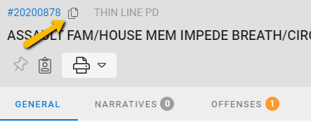

# Version 3.2.0

Welcome to the 3.2.0 release of Thin Line RMS/CAD. There are a number of updates in this version that we hope you like.

<!--
### Highlights
-->

<!--
### General System Highlights
<iframe width="560" height="315" src="https://www.youtube.com/embed/tlln1Ek_fSM" frameborder="0" allow="accelerometer; autoplay; encrypted-media; gyroscope; picture-in-picture" allowfullscreen></iframe>

### RMS/CAD Highlights
<iframe width="560" height="315" src="https://www.youtube.com/embed/3eAmemIk8fk" frameborder="0" allow="accelerometer; autoplay; encrypted-media; gyroscope; picture-in-picture" allowfullscreen></iframe>

### Contact Tracing Highlights
<iframe width="560" height="315" src="https://www.youtube.com/embed/05aQTWaCwuc" frameborder="0" allow="accelerometer; autoplay; encrypted-media; gyroscope; picture-in-picture" allowfullscreen></iframe>

### Administrative Highlights
<iframe width="560" height="315" src="https://www.youtube.com/embed/SrcEqOjxKw8" frameborder="0" allow="accelerometer; autoplay; encrypted-media; gyroscope; picture-in-picture" allowfullscreen></iframe>
-->

## General Changes

* Copy Shortcut added to some record numbers for easy copying.

* Fixed bug: accent change not refreshing
* Fixed bug: master record not selecting
* Made other small improvements and fixes

## RMS Changes

* Updated IBRS to intelligently auto-correct some validation errors
* Made other small improvements and fixes

## CAD Changes

* Made other small improvements and fixes

## Architecture Changes

* Updated Swagger authorization/authentication
* Made other small improvements and fixes
