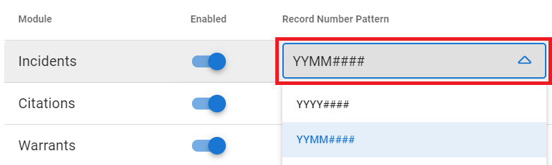
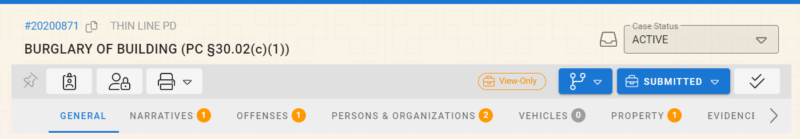
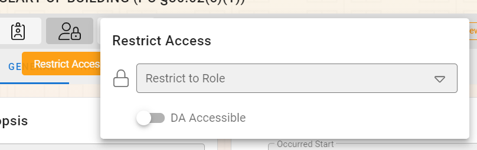
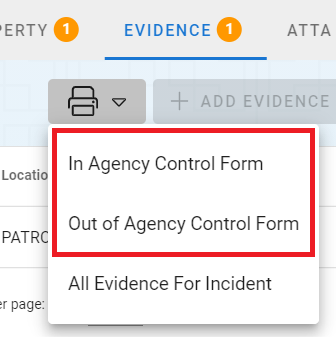
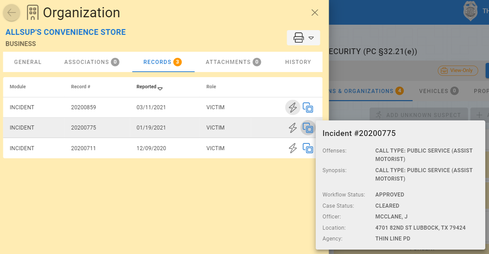
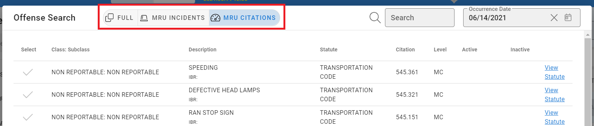

# Version 3.3.0

Welcome to the 3.3.0 release of Thin Line RMS/CAD. There are a number of updates in this version that we hope you like.

<!--### Highlights-->

### RMS Highlights
<iframe width="560" height="315" src="https://www.youtube.com/embed/RuVoU1J-dT8" title="YouTube video player" frameborder="0" allow="accelerometer; autoplay; clipboard-write; encrypted-media; gyroscope; picture-in-picture" allowfullscreen></iframe>

## General Changes

* Fixed small address merging bug when merging persons and organizations
* Added ability to disable certain system toast notifications
* Added new module record number format

* Updated background to subtly reflect time-of-day

* Made other small improvements and fixes

## RMS Changes

* Implement Texas IBRS version 3/2/2021
* Updated module record headers

* Added ability to restrict incident access based on roles

* Added evidence-out report; updated evidence-in report

* Added record previews

* Added most-recently-used (MRU) lists to offense lookup dialog

* Updated incident and notepad grids to refresh when master records change
* Updated notepad grids to match incident grids
* Fixed evidence bug (in grid and on incident report)
* Added information to evidence search result grid
* Made other small improvements and fixes

## CAD Changes

* Implemented self-dispatch (for select agencies)
* Made other small improvements and fixes

## Architecture Changes

* Updated SignalR logic
* Stubbed in Clery Act report logic
* Made other small improvements and fixes
