# Version 3.4.0

Welcome to the 3.4.0 release of Thin Line RMS/CAD. There are a number of updates in this version that we hope you like.

<!--### Highlights-->

<!--
### General System Highlights
<iframe width="560" height="315" src="https://www.youtube.com/embed/tlln1Ek_fSM" frameborder="0" allow="accelerometer; autoplay; encrypted-media; gyroscope; picture-in-picture" allowfullscreen></iframe>

### RMS/CAD Highlights
<iframe width="560" height="315" src="https://www.youtube.com/embed/3eAmemIk8fk" frameborder="0" allow="accelerometer; autoplay; encrypted-media; gyroscope; picture-in-picture" allowfullscreen></iframe>

### Contact Tracing Highlights
<iframe width="560" height="315" src="https://www.youtube.com/embed/05aQTWaCwuc" frameborder="0" allow="accelerometer; autoplay; encrypted-media; gyroscope; picture-in-picture" allowfullscreen></iframe>

### Administrative Highlights
<iframe width="560" height="315" src="https://www.youtube.com/embed/SrcEqOjxKw8" frameborder="0" allow="accelerometer; autoplay; encrypted-media; gyroscope; picture-in-picture" allowfullscreen></iframe>
-->

## General Changes

* Updated profile page to make options more visible
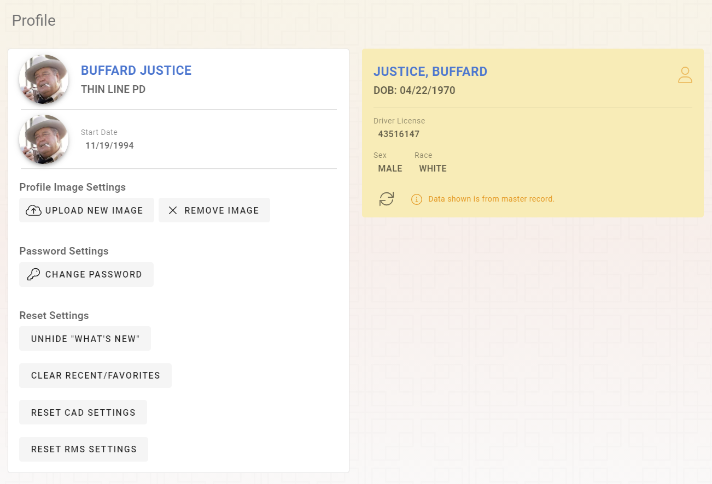
* Added ability to see password on Reset Password page
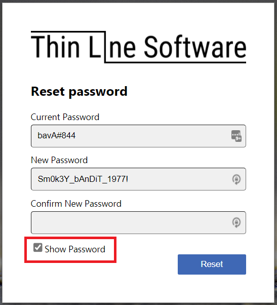
* Updated user feedback dialog to handle longer messages

* Made other small improvements and fixes

## RMS Changes

* Added Incident Synopsis report
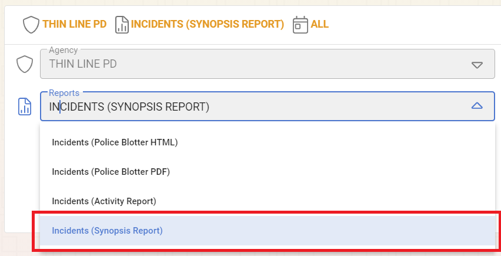
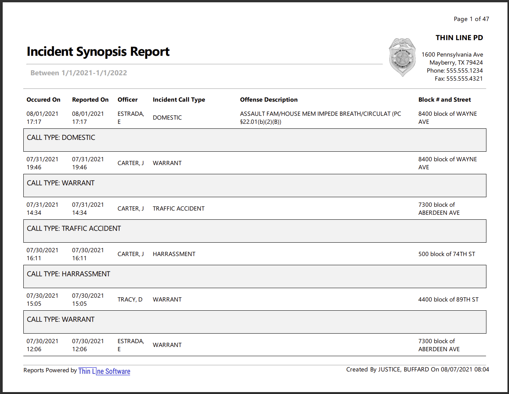
* Added "Internal Note" to incidents that won't display on reports
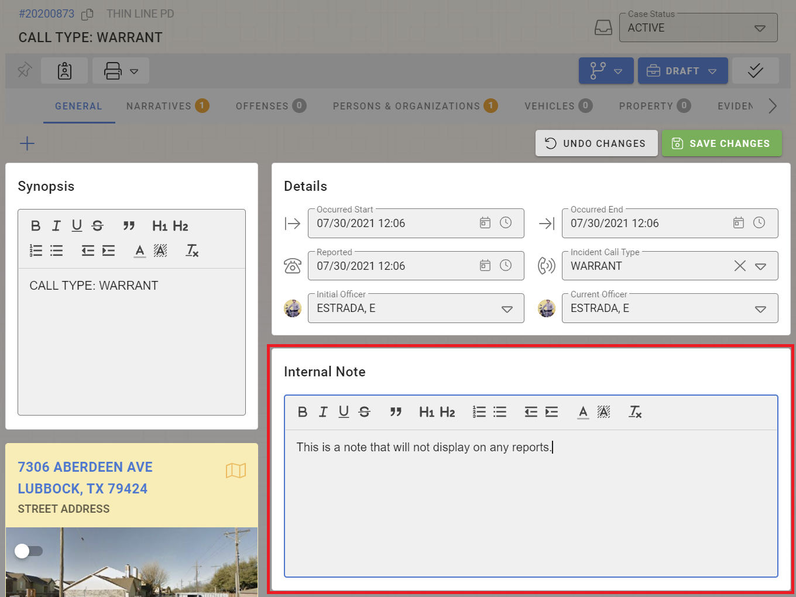
* Updated attachments to handle HEIC images
* Made other small improvements and fixes

## CAD Changes

* Updated call sheet search to use editable call sheet dialog
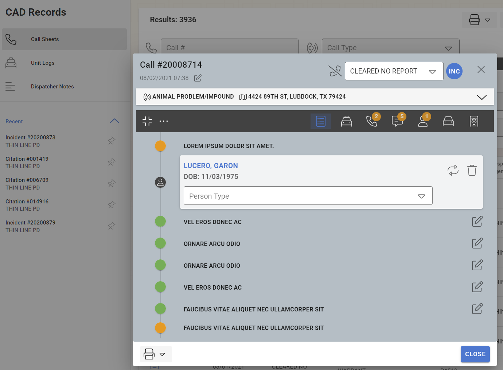
* Updated CAD styling (minor)
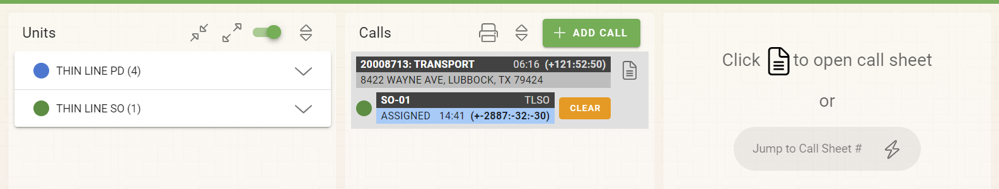
* Updated closed calls to include the most-recent 24 hours
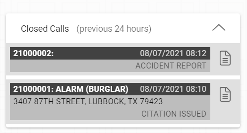
* Added call number to unit call notes
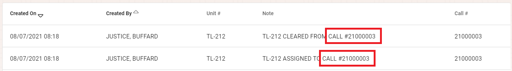
* Updated self-dispatch call sheet display
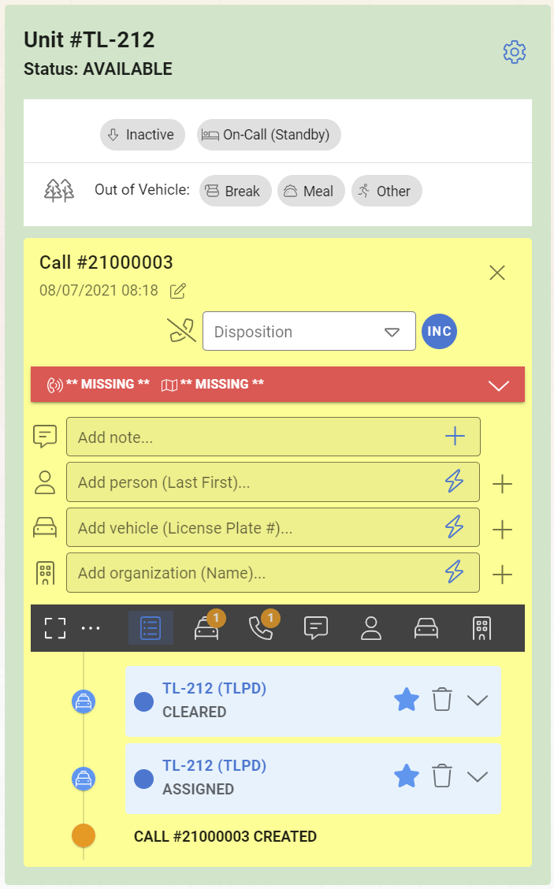
* Updated self-dispatch to assign officers to closed calls
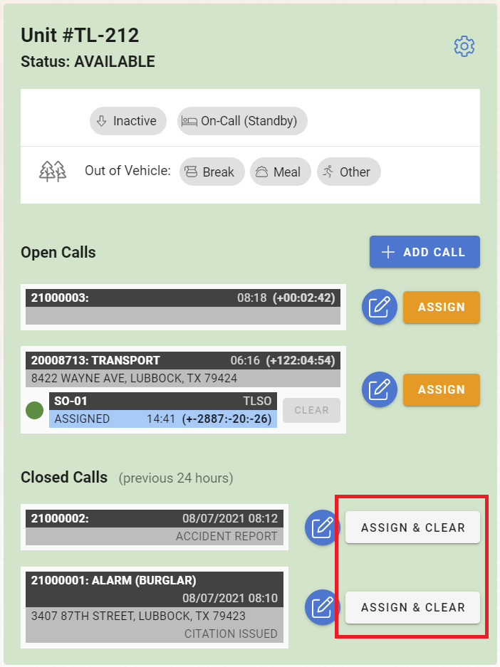
* Updated ability to edit dispatcher notes
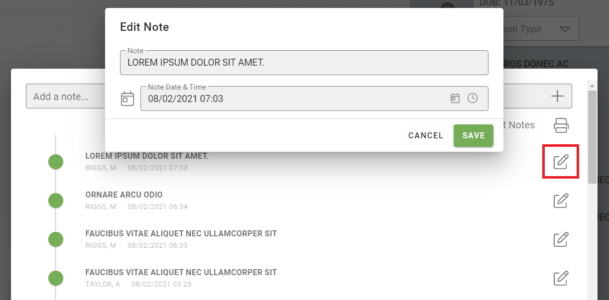
* Updated ability to edit call sheet notes
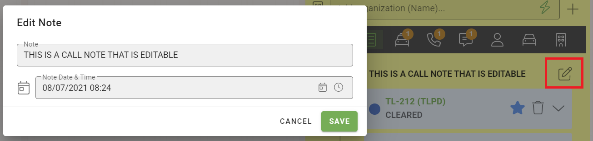
* Updated ability to edit unit notes
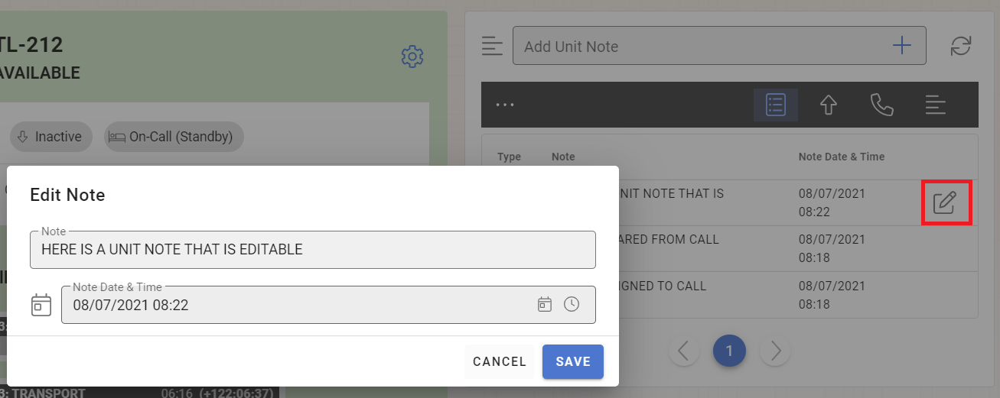
* Updated ability to edit call sheet date & time
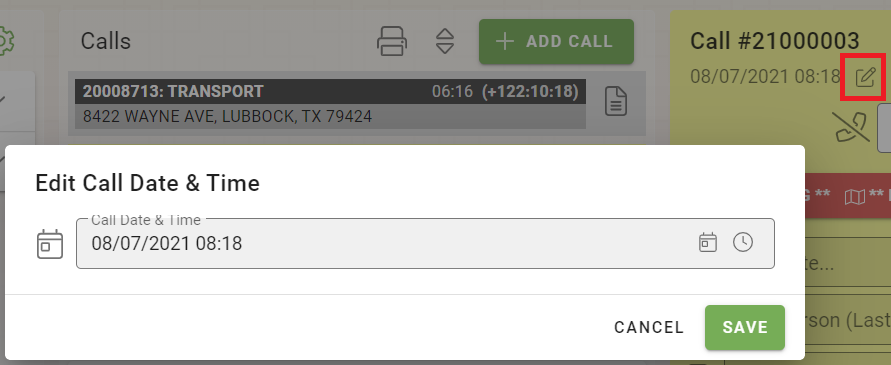
* Made other small improvements and fixes

## Architecture Changes

* Updated third-party libraries
* Made other small improvements and fixes
