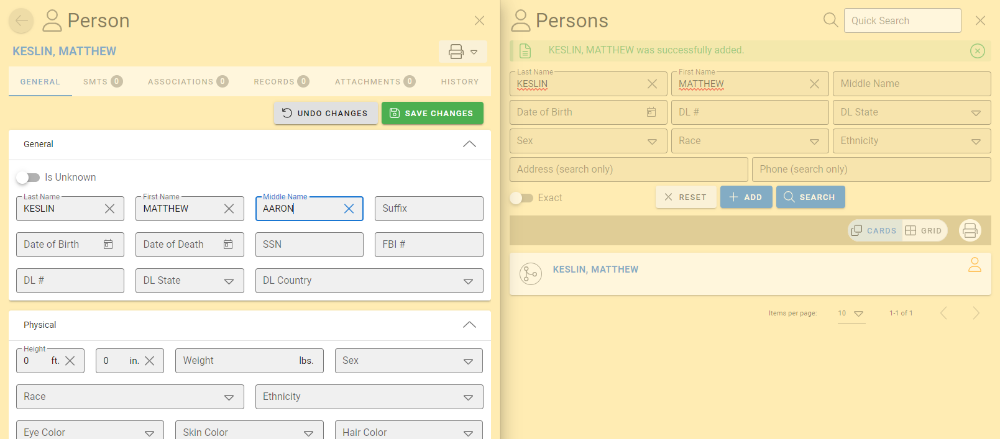
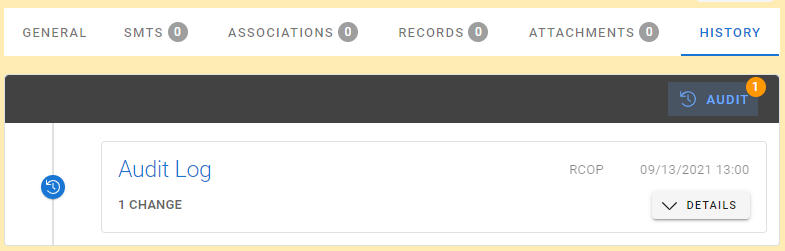
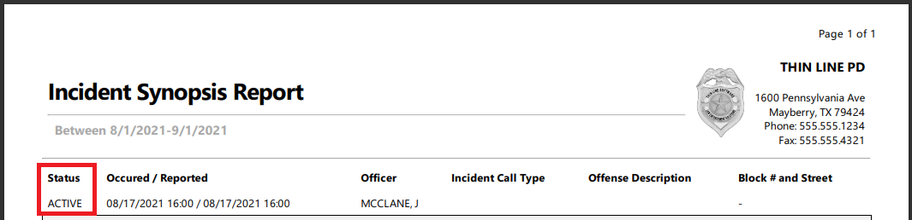
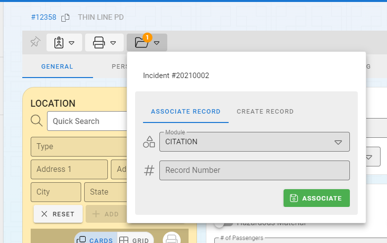
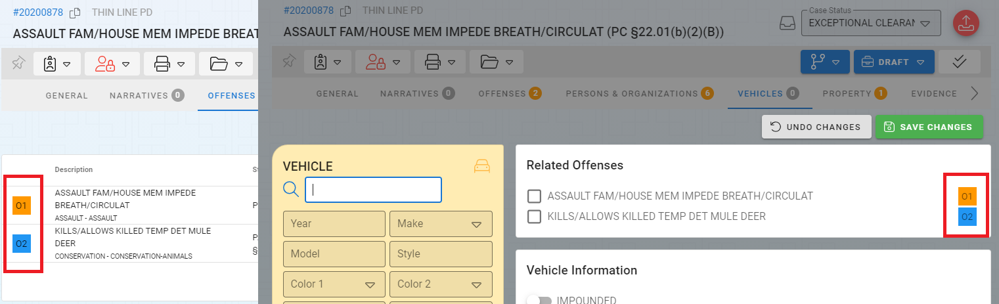
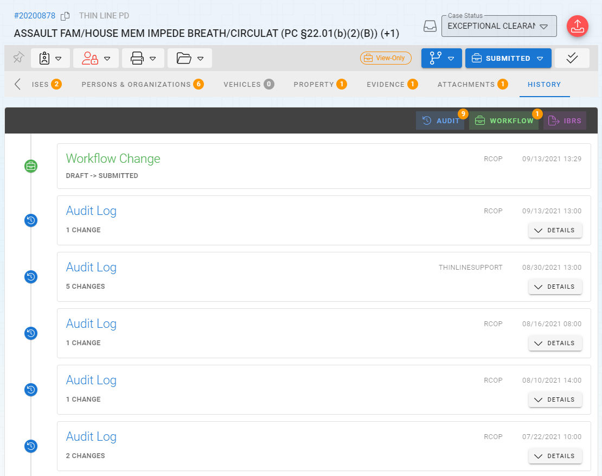
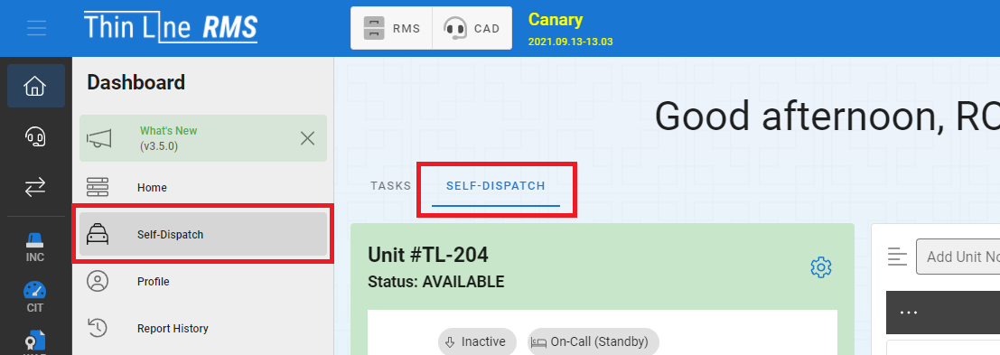

# Version 3.5.0

Welcome to the 3.5.0 release of Thin Line RMS/CAD. There are a number of updates in this version that we hope you like.

<!--### Highlights-->

<!--
### General System Highlights
<iframe width="560" height="315" src="https://www.youtube.com/embed/tlln1Ek_fSM" frameborder="0" allow="accelerometer; autoplay; encrypted-media; gyroscope; picture-in-picture" allowfullscreen></iframe>

### RMS/CAD Highlights
<iframe width="560" height="315" src="https://www.youtube.com/embed/3eAmemIk8fk" frameborder="0" allow="accelerometer; autoplay; encrypted-media; gyroscope; picture-in-picture" allowfullscreen></iframe>

### Contact Tracing Highlights
<iframe width="560" height="315" src="https://www.youtube.com/embed/05aQTWaCwuc" frameborder="0" allow="accelerometer; autoplay; encrypted-media; gyroscope; picture-in-picture" allowfullscreen></iframe>

### Administrative Highlights
<iframe width="560" height="315" src="https://www.youtube.com/embed/SrcEqOjxKw8" frameborder="0" allow="accelerometer; autoplay; encrypted-media; gyroscope; picture-in-picture" allowfullscreen></iframe>
-->

## General Changes

* Added logic to prevent master detail navigation drawer from closing if it is being edited

* Added audit timeline to master records

* Made other small improvements and fixes

## RMS Changes

* Added case status to incident synopsis report

* Added record folders to associate and create records

* Added incident offense indicator for disambiguation

* Added audit timeline to module records

* Updated TX offense codes to version 18
* Made significant performance improvements to racial profiling report
* Fixed data issue related to master property drug measurement codes
* Fixed bug when incident full report note contained a pound sign
* Made other small improvements and fixes

## CAD Changes

* Renamed "Unit & Calls" to "Self-Dispatch"

* Made significant performance improvements
* Updated call sheet to store entry data in session storage
* Made other small improvements and fixes

## Architecture Changes

* Updated third-party libraries
* Made other small improvements and fixes
