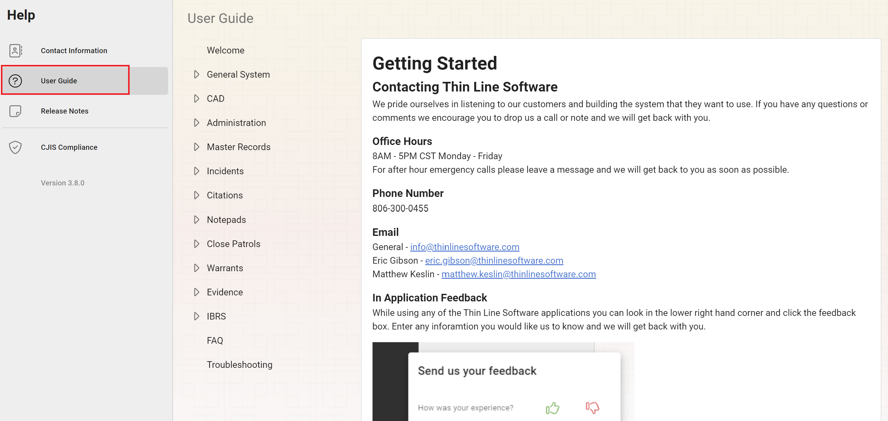
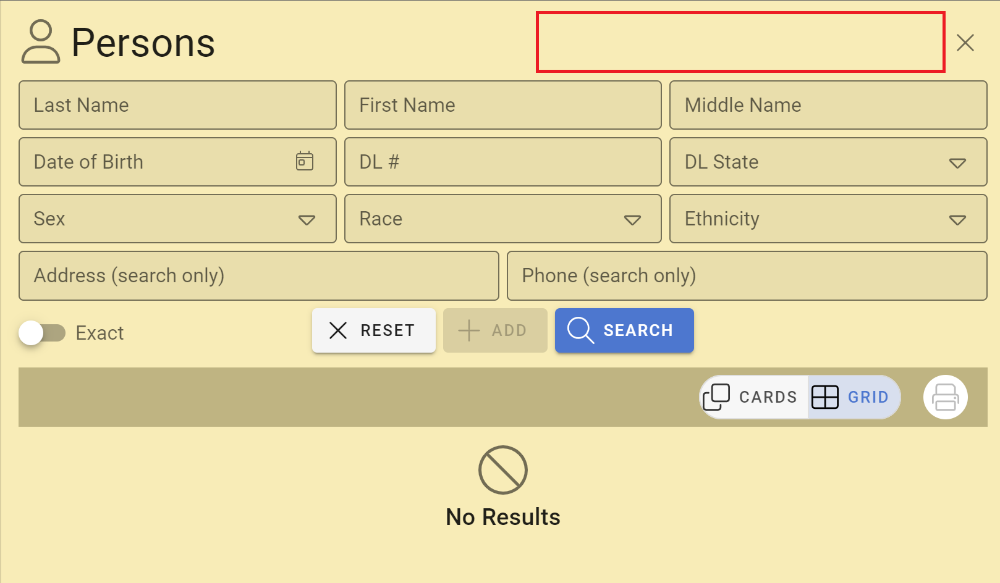
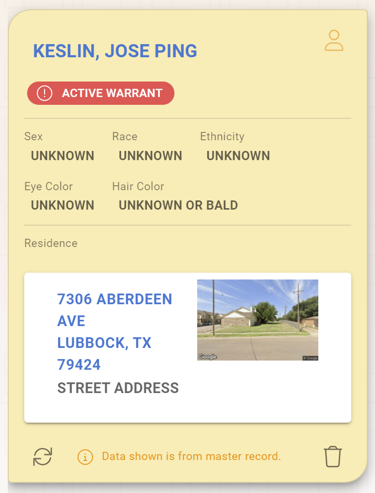
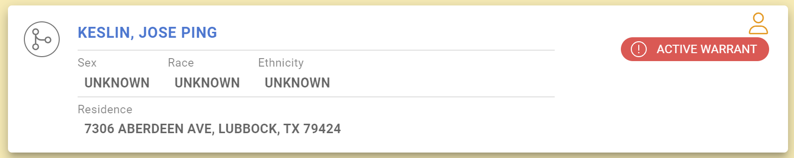
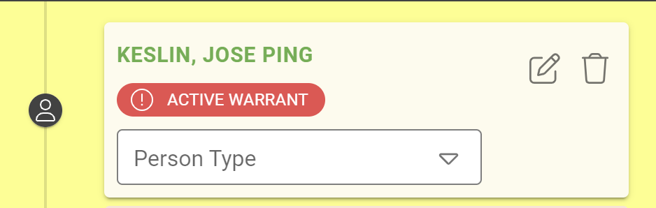
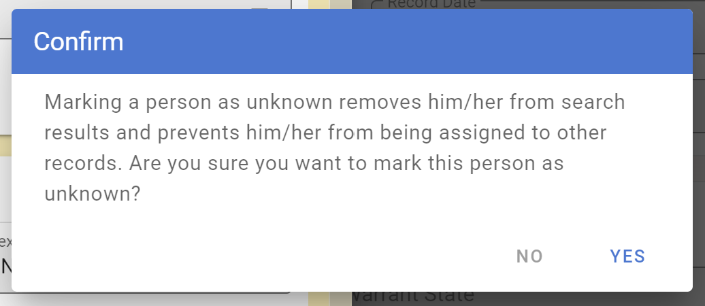
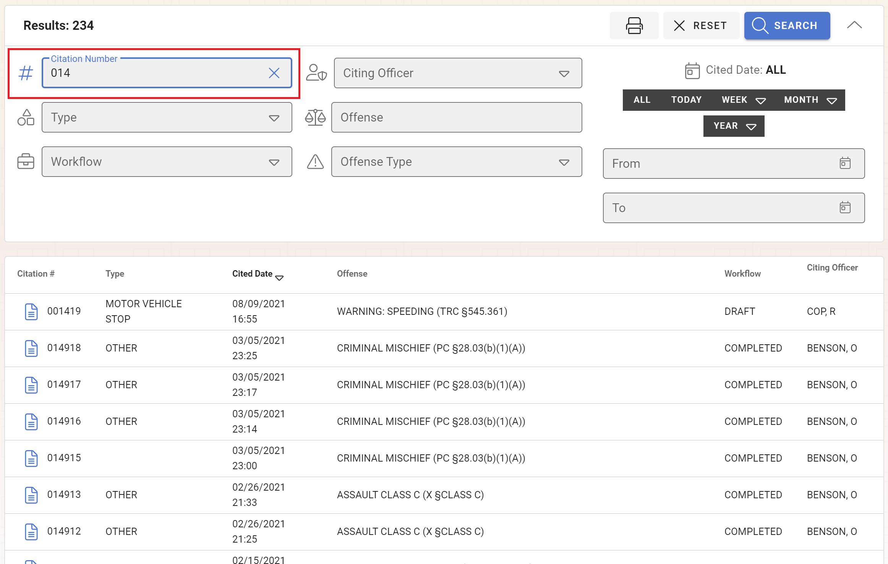
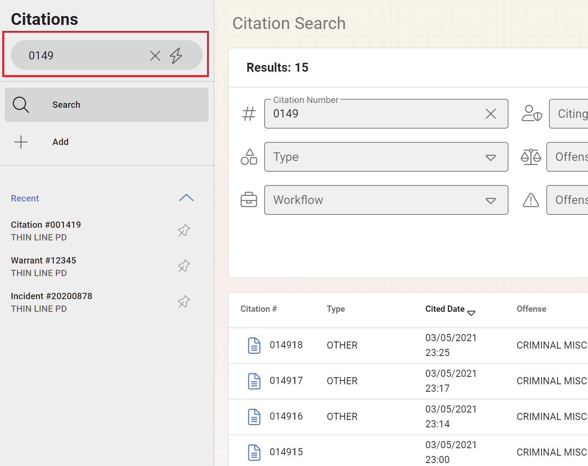
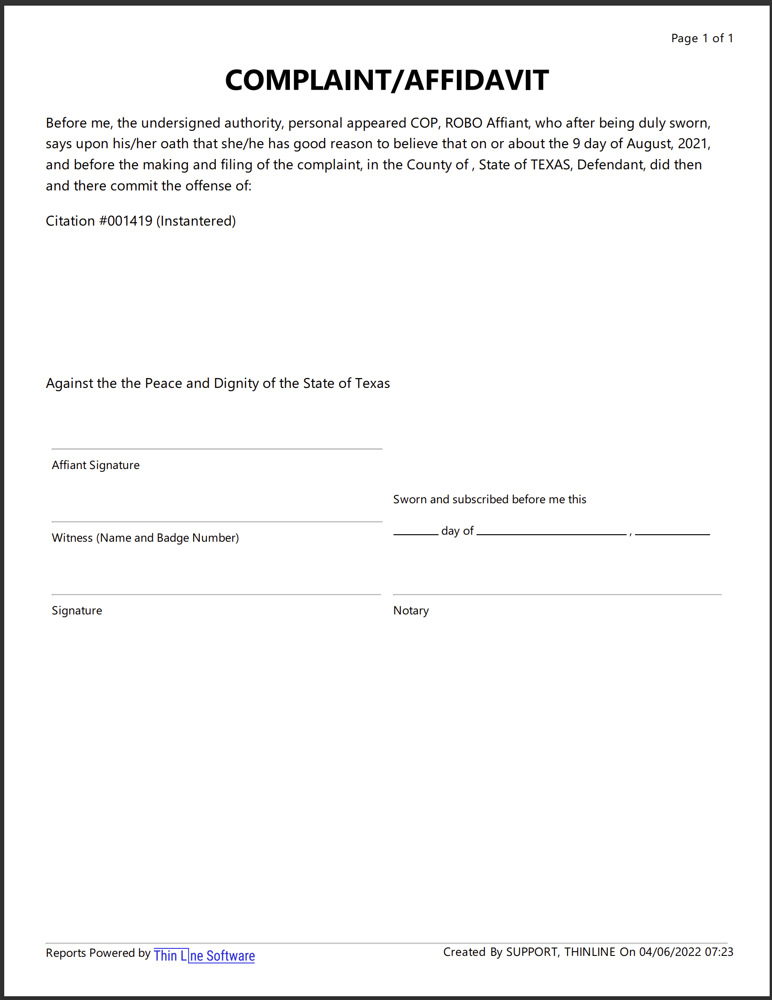
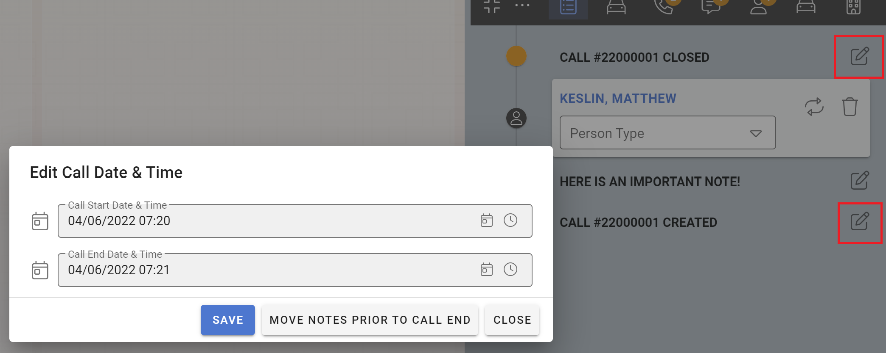

# Version 3.8.0

Welcome to the 3.8.0 release of Thin Line RMS/CAD. There are a number of updates in this version that we hope you like.

<!--### Highlights-->

<!--
### General System Highlights
<iframe width="560" height="315" src="https://www.youtube.com/embed/tlln1Ek_fSM" frameborder="0" allow="accelerometer; autoplay; encrypted-media; gyroscope; picture-in-picture" allowfullscreen></iframe>

### RMS/CAD Highlights
<iframe width="560" height="315" src="https://www.youtube.com/embed/3eAmemIk8fk" frameborder="0" allow="accelerometer; autoplay; encrypted-media; gyroscope; picture-in-picture" allowfullscreen></iframe>

### Contact Tracing Highlights
<iframe width="560" height="315" src="https://www.youtube.com/embed/05aQTWaCwuc" frameborder="0" allow="accelerometer; autoplay; encrypted-media; gyroscope; picture-in-picture" allowfullscreen></iframe>

### Administrative Highlights
<iframe width="560" height="315" src="https://www.youtube.com/embed/SrcEqOjxKw8" frameborder="0" allow="accelerometer; autoplay; encrypted-media; gyroscope; picture-in-picture" allowfullscreen></iframe>
-->

<!--  -->

## General Changes

* Added user guide (also available <a href="https://docs2.thinlinesoftware.com/guide?content=getstarted" target="_blank">here</a>)
  
* Removed master quick search functionality
  
* Added active warrant indicator to person search/details
  
  
  
* Added confirmation dialog when marking a person as unknown
  
* Fixed sorting issue in Report History report
* Fixed image scaling issue
* Made other small improvements and fixes

## RMS Changes

* Added record number search to module searches
  
* Added logic for partial searches in quick search
  
* Added Criminal Complaint report to citations
  
* Added logic to edit call end date/time
  
* Added functionality to batch move note dates/times 
* Added court info to citation reports
* Added new TIBRS version (06/2021)
* Fixed issue with close patrol grid print
* Fixed some bugs with record groups
* Fixed some issues with racial profiling validations
* Updated logic to create suspect role when arrestee is pushed from call to incident
* Updated logic so warnings are not copied to warrant when created from citation
* Fixed bug with warrant/incident searches
* Hid Internal Notes from DA users
* Fixed bug with Arrest Affidavit/Juvenile Referral
* Updated racial profiling search
* Made other small improvements and fixes

## CAD Changes

* Made small improvements and fixes

## Architecture Changes

* Updated .Net to version 6
* Updated IdentityServer
* Updated other third-party libraries
* Integrated new documentation service
* Made other small improvements and fixes
