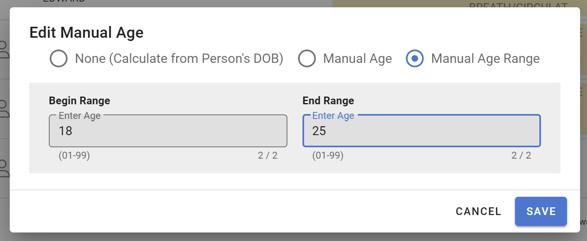
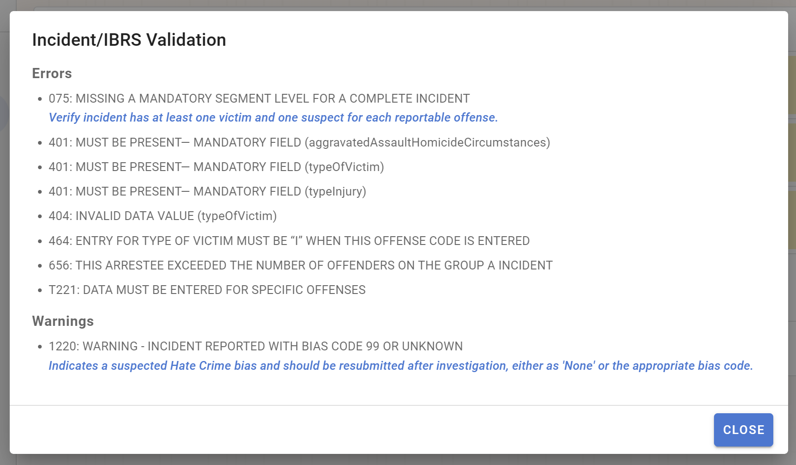
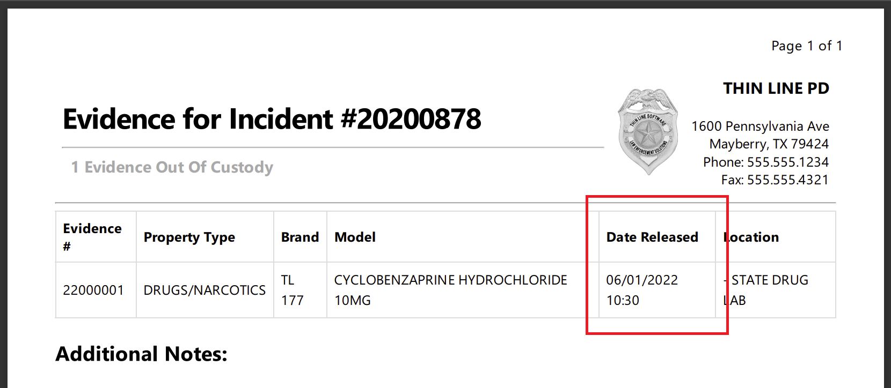

# Version 3.9.0

Welcome to the 3.9.0 release of Thin Line RMS/CAD. There are a number of updates in this version that we hope you like.

<!--### Highlights-->

<!--
### General System Highlights
<iframe width="560" height="315" src="https://www.youtube.com/embed/tlln1Ek_fSM" frameborder="0" allow="accelerometer; autoplay; encrypted-media; gyroscope; picture-in-picture" allowfullscreen></iframe>

### RMS/CAD Highlights
<iframe width="560" height="315" src="https://www.youtube.com/embed/3eAmemIk8fk" frameborder="0" allow="accelerometer; autoplay; encrypted-media; gyroscope; picture-in-picture" allowfullscreen></iframe>

### Contact Tracing Highlights
<iframe width="560" height="315" src="https://www.youtube.com/embed/05aQTWaCwuc" frameborder="0" allow="accelerometer; autoplay; encrypted-media; gyroscope; picture-in-picture" allowfullscreen></iframe>

### Administrative Highlights
<iframe width="560" height="315" src="https://www.youtube.com/embed/SrcEqOjxKw8" frameborder="0" allow="accelerometer; autoplay; encrypted-media; gyroscope; picture-in-picture" allowfullscreen></iframe>
-->

<!--  -->

## General Changes

* Updated task board to exclude deleted records (e.g. citations)
* Made other small improvements and fixes

## RMS Changes

* Updated incident age dialog to support IBRS age ranges
  
* Enabled newest versions of NIBRS/TIBRS
* Added support for workflow warnings (IBRS warnings)
  
* Added/updated NIBRS/TIBRS validation errors/warnings
* Updated Evidence Out report to show released date
  
* Updated logic in incident/citation offense most-recently-used lists
* Made other small improvements and fixes

## CAD Changes

* Added ability to scan vehicle registration tags for mobile citations (beta release)
* Made other small improvements and fixes

## Architecture Changes

* Updated third-party libraries
* Made other small improvements and fixes
