# Version 4.0.0

Welcome to the 4.0.0 release of Thin Line RMS/CAD. There are a number of updates in this version that we hope you like.

<!--### Highlights-->

<!--
### General System Highlights
<iframe width="560" height="315" src="https://www.youtube.com/embed/tlln1Ek_fSM" frameborder="0" allow="accelerometer; autoplay; encrypted-media; gyroscope; picture-in-picture" allowfullscreen></iframe>

### RMS/CAD Highlights
<iframe width="560" height="315" src="https://www.youtube.com/embed/3eAmemIk8fk" frameborder="0" allow="accelerometer; autoplay; encrypted-media; gyroscope; picture-in-picture" allowfullscreen></iframe>

### Contact Tracing Highlights
<iframe width="560" height="315" src="https://www.youtube.com/embed/05aQTWaCwuc" frameborder="0" allow="accelerometer; autoplay; encrypted-media; gyroscope; picture-in-picture" allowfullscreen></iframe>

### Administrative Highlights
<iframe width="560" height="315" src="https://www.youtube.com/embed/SrcEqOjxKw8" frameborder="0" allow="accelerometer; autoplay; encrypted-media; gyroscope; picture-in-picture" allowfullscreen></iframe>
-->

<!--  -->

## General Changes

- Updated icons, buttons, toast notifications, and other UI components
  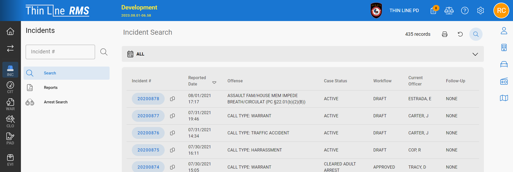
- Improved dashboard task list
  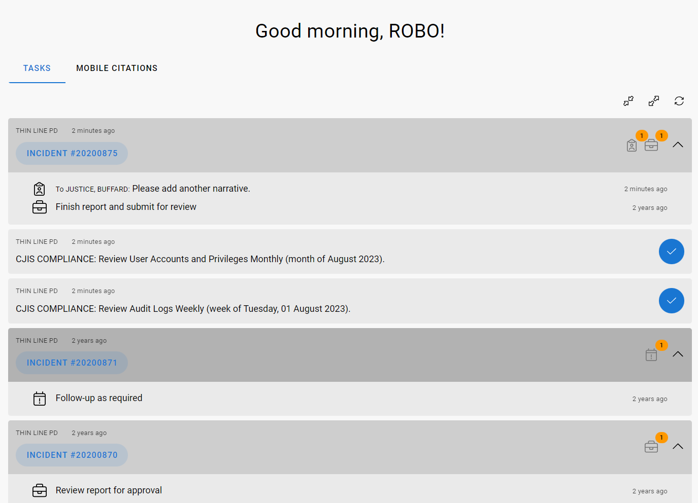
- Added task notification icon to header
  
- Updated module and master tabs
  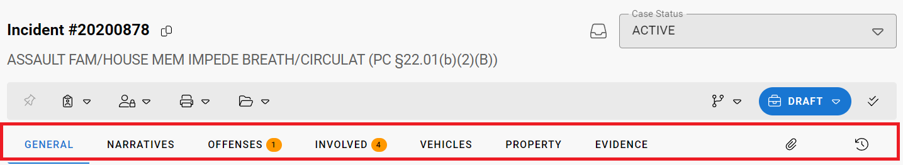
- Added new options (tags and aliases) to master person search options and results
  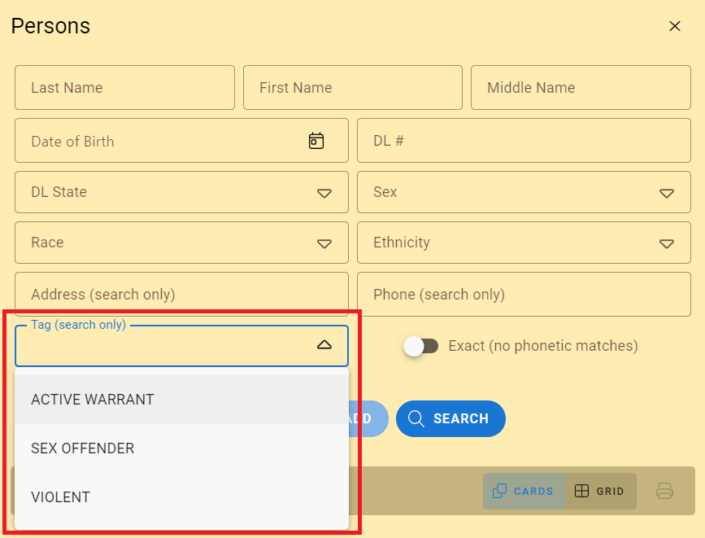
  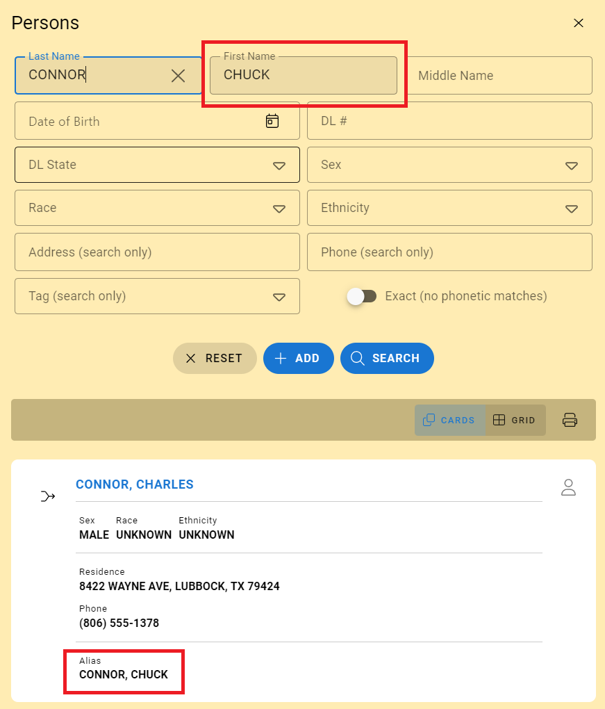
- Added new options (tags and aliases) to master person grid prints
  <!-- - Updated call sheet search results to allow opening read-only preview and full call sheet -->
    <!--  -->
- Added ability to print citations in mobile format (if mobile citations enabled)
  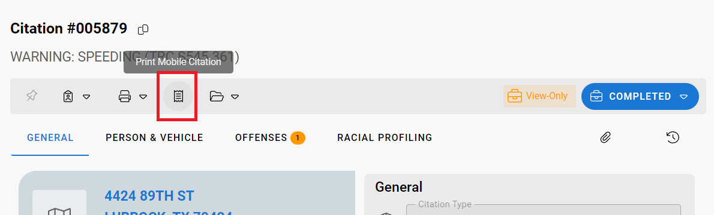
  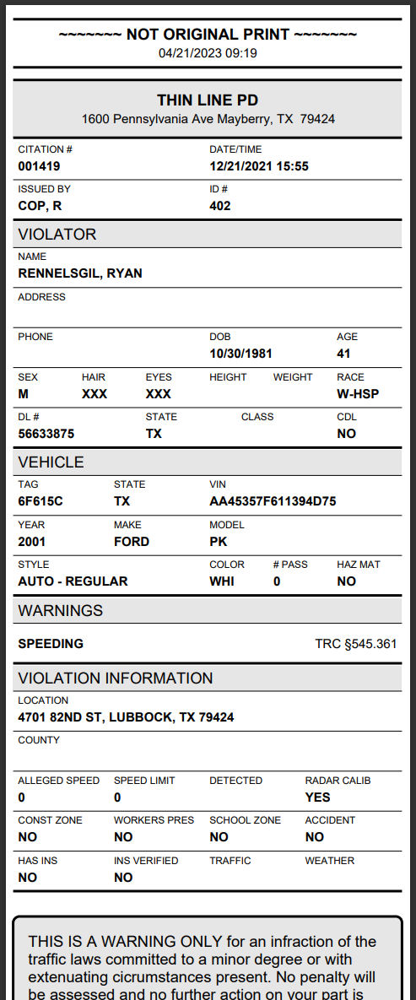
- Added additional agency configuration settings
  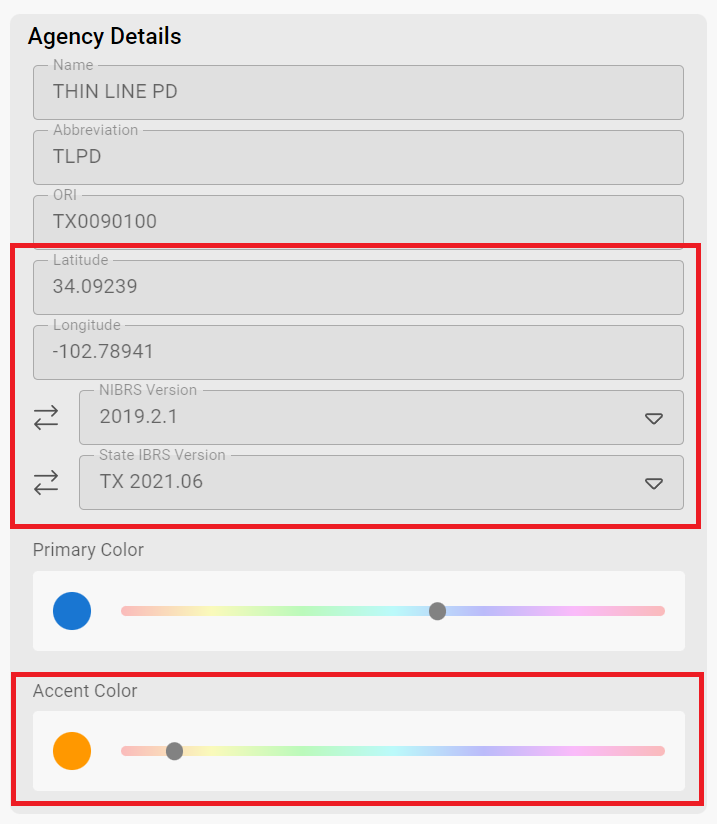
- Improved offense search layout
  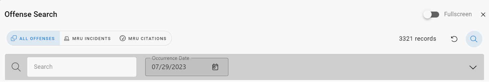
- Removed minimum resolution width
  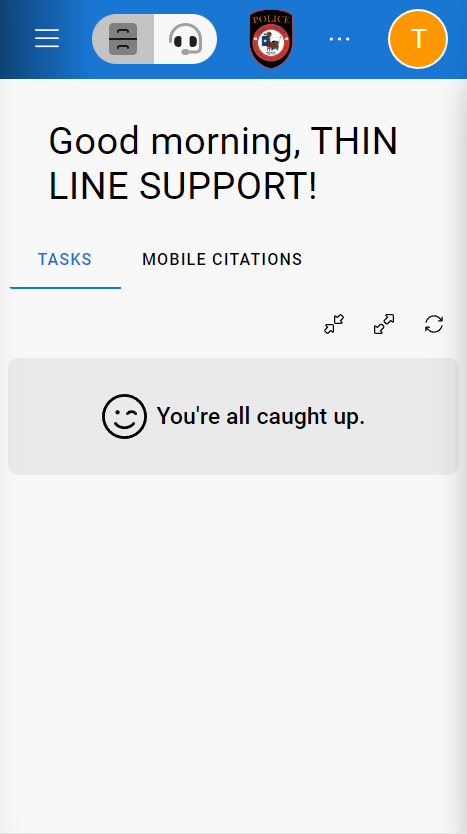
- Fixed cursor jump when editing text fields
- Fixed issue where page bottom was cut-off on mobile browsers
- Made other small improvements and fixes

## RMS Changes

- Updated "Save Changes" button to remain fixed while editing
  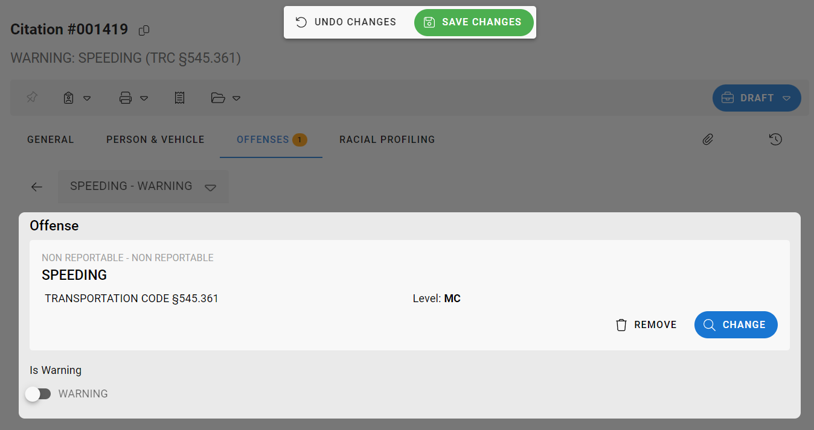
- Updated module details grids to use cards
  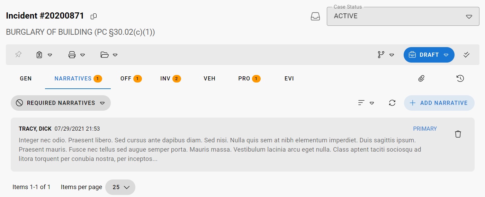
  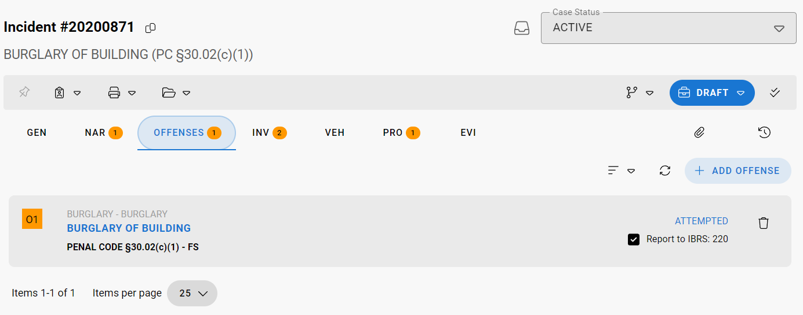
- Made other small improvements and fixes

## CAD Changes

- Added ability to parse intersections
- Added ability to add unit to closed calls from within call sheet
  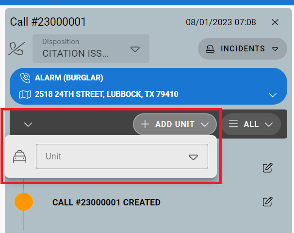
- Updated ability to set agency color for CAD
  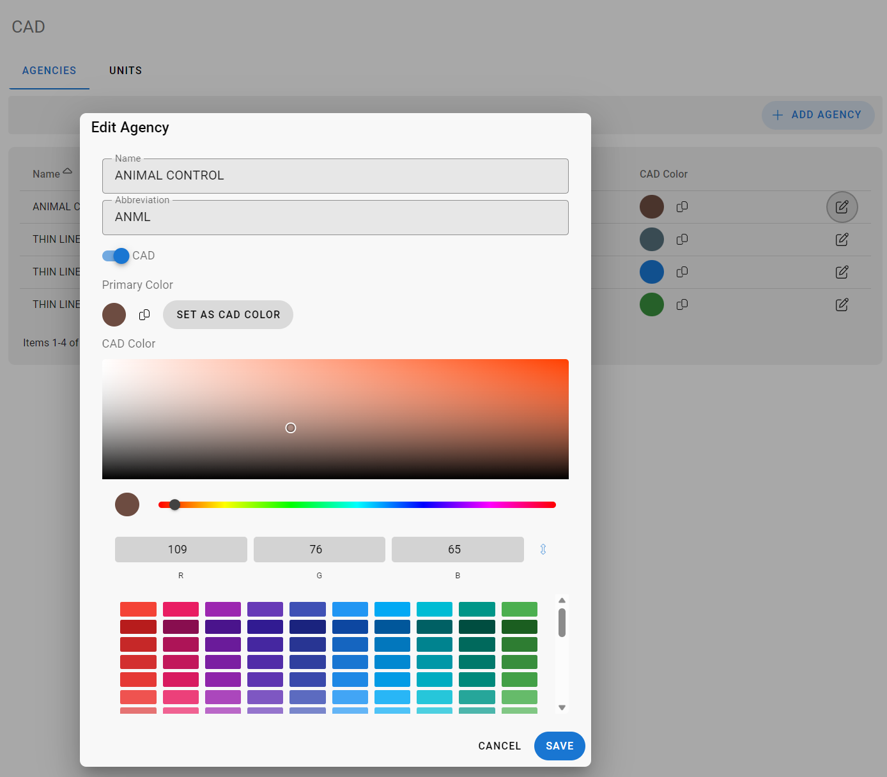
- Updated unit card layout
- Updated call sheet timeline filtering
  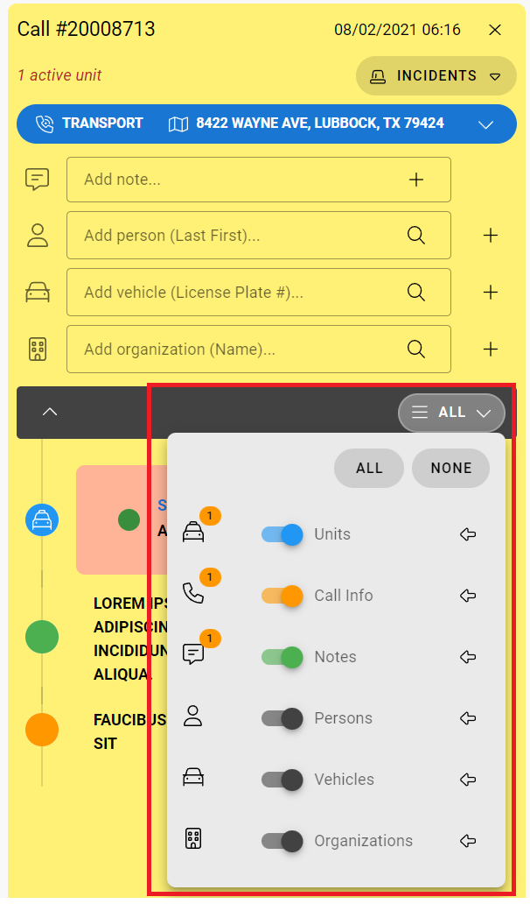
- Made other small improvements and fixes

## Architecture Changes

- Updated to Vue 3 and Vuetify 3
- Updated other client-side libraries
- Updated server-side libraries
- Made other small improvements and fixes
